

# DC Motor Control Using PWM

This project is an upgrade to [DC motor constant speed](https://mplabxpress.microchip.com/mplabcloud/Example/Details/712). The additional feature is the use of a timer with Hardware Limit Timer feature (HLT) to stop the motor driving if the motor gets stalled. The timer is configured to overflow and generate an interrupt every 50 ms. The HLT reads the pulses from the phototransistor and resets the timer on every signal edge, so when the motor is running, the timer never overflows. If the motor is stopped however by an external force, then the pulses from the phototransistor will also stop, and the HLT will not reset the timer anymore, thus letting the timer to overflow after 50 ms. On the ISR, the motor driving is turned off, in order to prevent the damaging of the driving circuit.

## Related Documentation
- [PIC16F18875 Product Family Page](https://www.microchip.com/design-centers/8-bit/pic-mcus/device-selection/pic16F18875)
- [PIC16F18875 datasheet](http://ww1.microchip.com/downloads/en/DeviceDoc/40001802G.pdf) for more information or specifications.

## Software Used
- MPLAB® X IDE 5.30 or newer [(microchip.com/mplab/mplab-x-ide)](http://www.microchip.com/mplab/mplab-x-ide)
- MPLAB® XC8 2.10 or newer compiler [(microchip.com/mplab/compilers)](http://www.microchip.com/mplab/compilers)
- MPLAB® Code Configurator (MCC) 3.95 or newer [(microchip.com/mplab/mplab-code-configurator)](https://www.microchip.com/mplab/mplab-code-configurator)
- MPLAB® Code Configurator (MCC) PIC10/PIC12/PIC16/PIC18 library v1.79 or newer [(microchip.com/mplab/mplab-code-configurator)](https://www.microchip.com/mplab/mplab-code-configurator)

# Hardware Requirements #

## Hardware Used
- PIC16F18875 PDIP40 with Curiosity High Pin Count (HPC) Development Board [(DM164136)](https://www.microchip.com/Developmenttools/ProductDetails/DM164136)
- Power NMOS transistor: F15N60E / IRF540N / etc.
- DC motor: PAN14EE12AA1 or similar
- Power supply for the DC motor: 9V 1.3A / other, depending on the motor
- Generic 5mm white LED / other similar
- Phototransistor: TEPT5700 / other similar
- 3D printed assembly / other mechanical setup

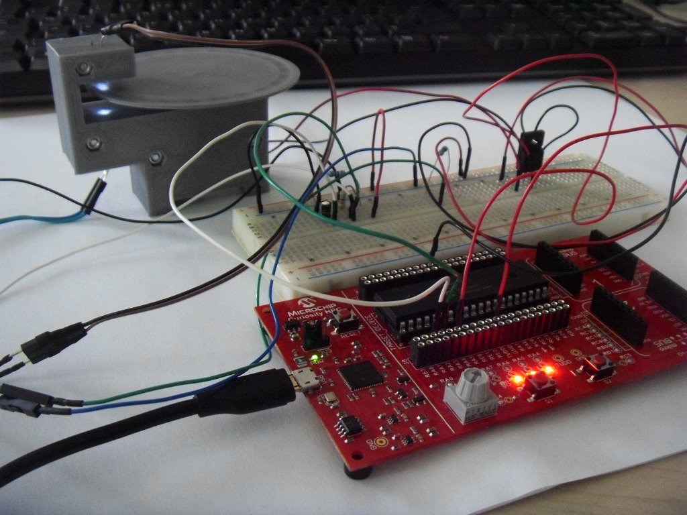

## Setup

In this demo,

- PIC16F18875 MCU is used to generate the PWM signal.
- The Curiosity HPC board is used as it has got on-board programmer and debugger.
- A 3D printed spinning wheel with 24 holes on its circumference is mounted on the motor shaft.
- A 3D printed case holds the motor in place, and also an LED and a phototransistor that act as an encoder so that when the spinning wheel is rotating, the holes create pulses in the light that gets to the phototransistor, with a frequency that is proportional to the rotation speed.
- An analog comparator of the PIC16F18875 is used to read the pulses from the phototransistor and output a square wave.
- Signal Measurement Timer (SMT) is used to measure the period of the square wave. That can be done with a normal timer as well, but requires more code. With the SMT it is straightforward.
- The PIC reads the period from the SMT and computes the rotation speed (in RPM) and compares it against the desired rotation speed that is set using the potentiometer.
- The PWM is adjusted in order to compensate the speed error.
- The result is that the rotation speed stays constant and does not depend on the motor load.
- A timer with HLT is used to stop driving the motor if the motor gets stalled.

The 3D printed parts are presented in the picture below:

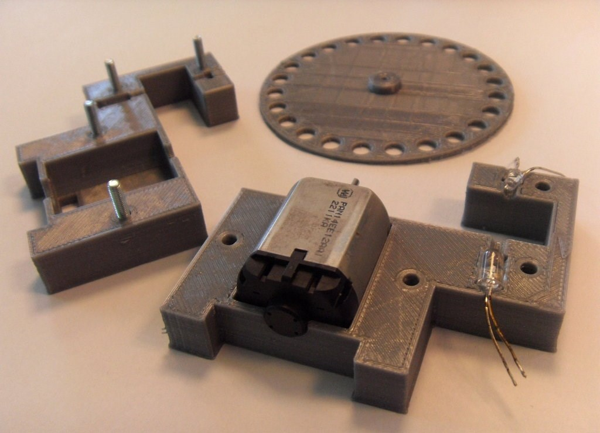

The flow diagram is presented in the picture below:

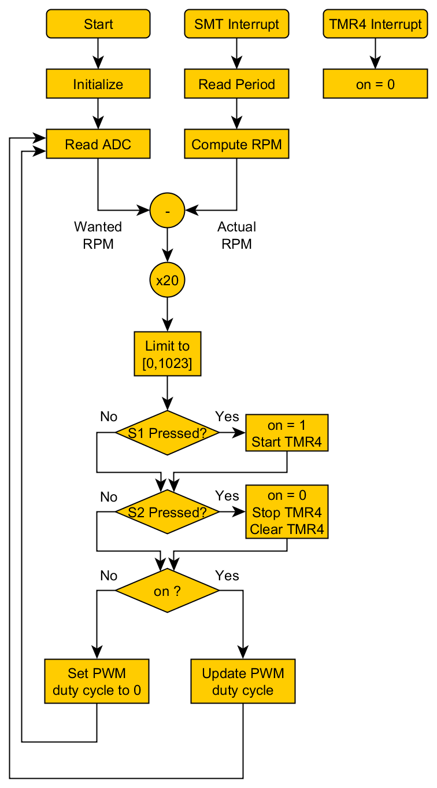

### Demo Hardware Instructions

- Mount the spinning wheel on the motor shaft.
- Mount the motor, LED and phototransistor inside the 3D printed case and assemble it using M3 bolts and nuts. It should look like this:

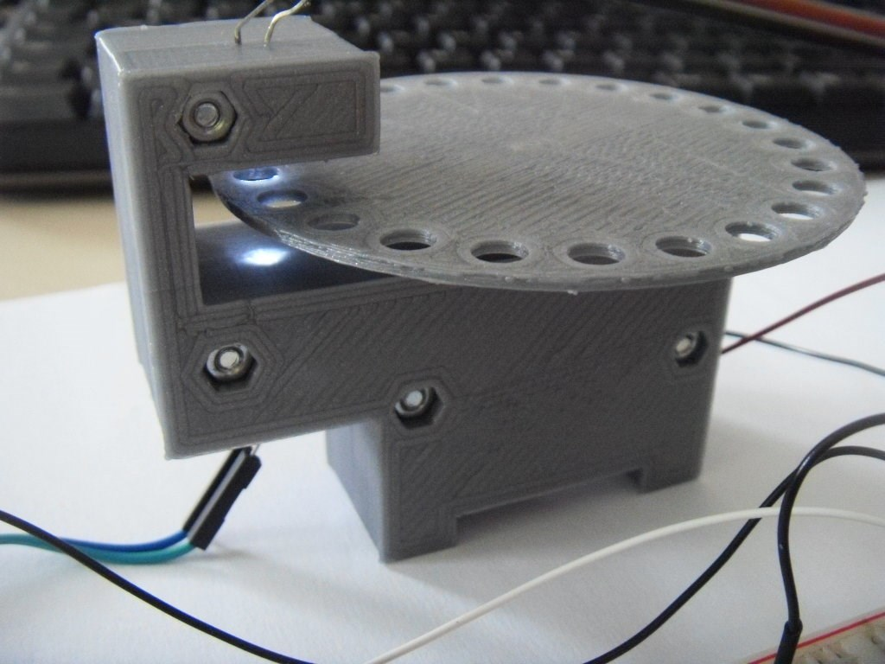

- Make the connections according to this schematic:

### MCC Settings

This section shows the settings used in the demo/example for various MCU modules configuration. These settings were done using the Microchip Code Configurator (MCC). Open MCC to look at the settings of the modules.

### System Module Settings

The MCU uses the high frequency internal oscillator (HFINTOSC), and the clock is set to 32 MHz. Watchdog Timer is not used in this demo, so it is disabled.

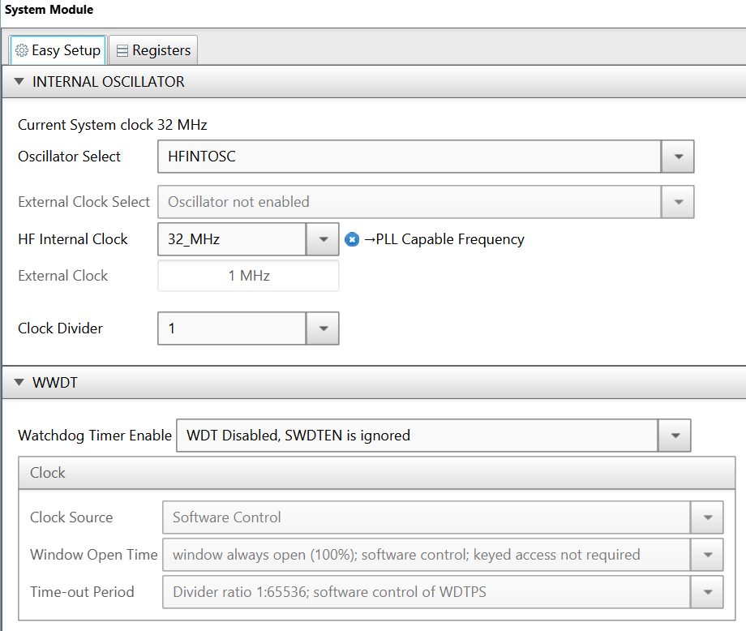

### ADCC Settings

ADCC is used to read the potentiometer. It is configured to operate in Low pass filter mode, with a clock of Fosc/32.

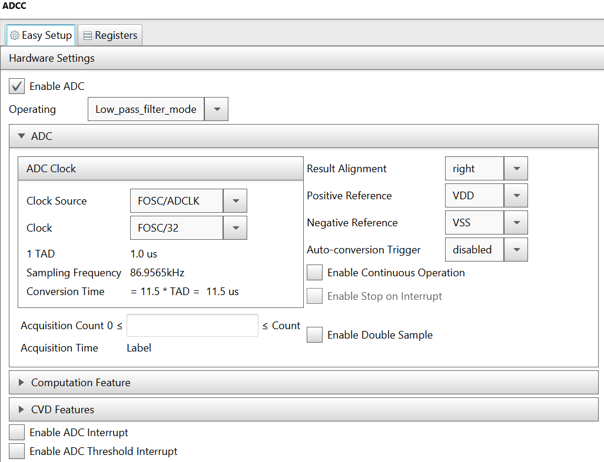

For the Low pass filter mode, there are 2 more settings that must be configured from the Registers view. They are ADRPT and ADCRS.

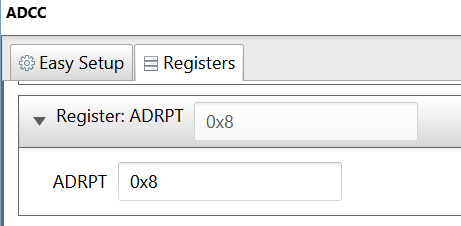

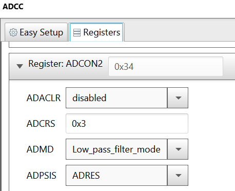

With these settings, the filtering will use 8 ADC samples.

### TMR2 Settings

The TMR2 is used as a clock source for the PWM signal.

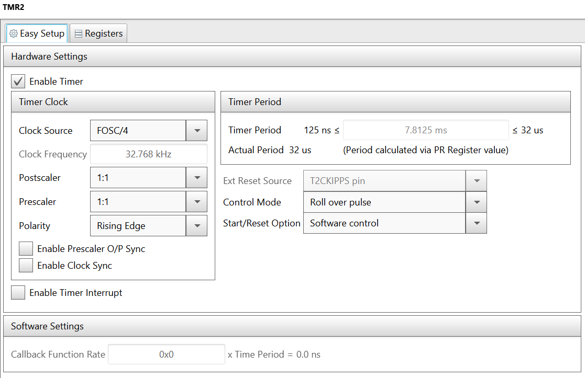

### PWM6 Settings

The PWM6 is used to generate the PWM signal for the motor. It uses the TMR2 as clock source. The duty cycle is updated at runtime according to the amplified difference between the desired speed and the speed set with the potentiometer..

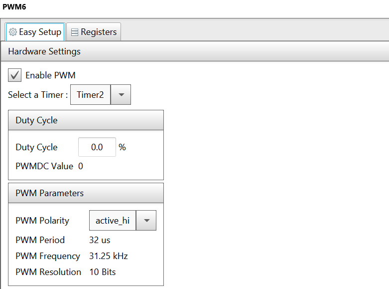

### CMP1 Settings

The CMP1 analog comparator is used to read the phototransistor and output a square wave.

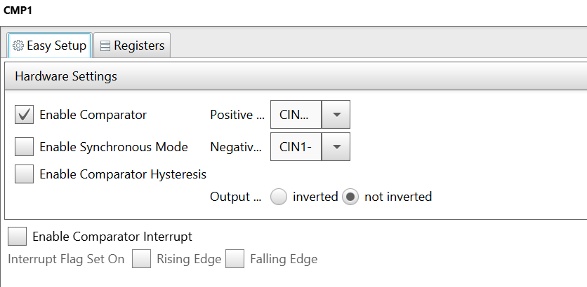

### SMT1 Settings

The Signal Measurement Timer is configured in Period and Duty-Cycle Acquisition mode, with the signal coming from the output of the CMP1. The SMT1 has MFINTOSC/16 set as clock source, so it will count in steps of 32 microseconds. Other clock sources can be selected depending on the range of the measured signal.

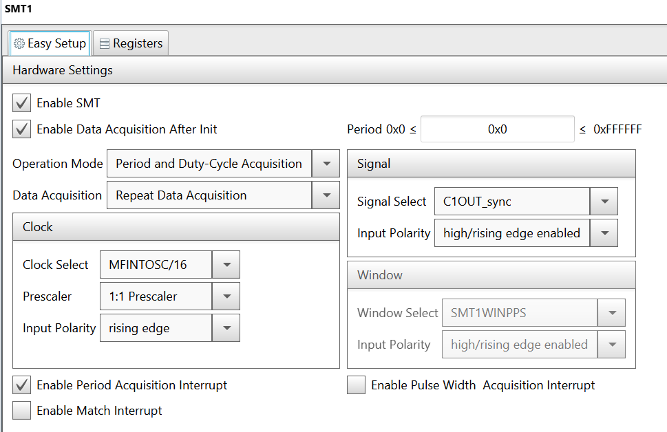

### TMR4 (with HLT) Settings

The TMR4 with the HLT feature is used to turn off the motor driving if the motor gets stalled. It is configured to interrupt after 49.92 ms, and to reset at rising/falling edges of the C1OUT, which is the output of CMP1 comparator. When the motor is running, the comparator reads the pulses and the TMR4 keeps resetting. When the motor gets stopped however, the TMR4 does not reset anymore and generates the interrupt, and the ISR stops the motor.

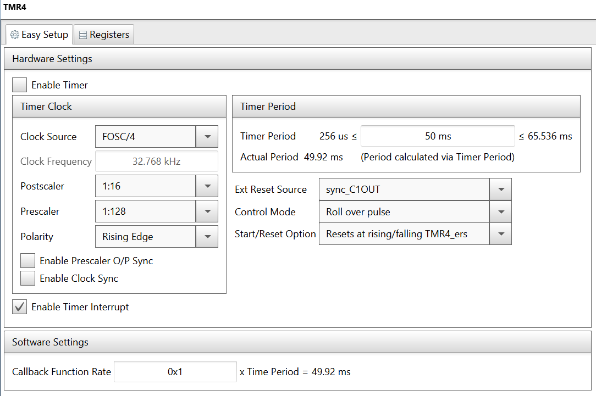

### Pin Manager Settings

The pins are configured as follows:

- ADCC input on RA0, named channel_ANA0
- PWM6 output on RA4
- CMP1 negative input on RA1
- CMP1 positive input on RA2
- CMP1 output on RA5 (for debug on the D3 LED)
- GPIO output on RA6, named LED_D4 (for debug, toggled from code on every period acquisition)
- GPIO input on RB4, named S1 (for reading the S1 switch), with weak pull-up enabled
- GPIO input on RC5, named S2 (for reading the S2 switch), with weak pull-up enabled

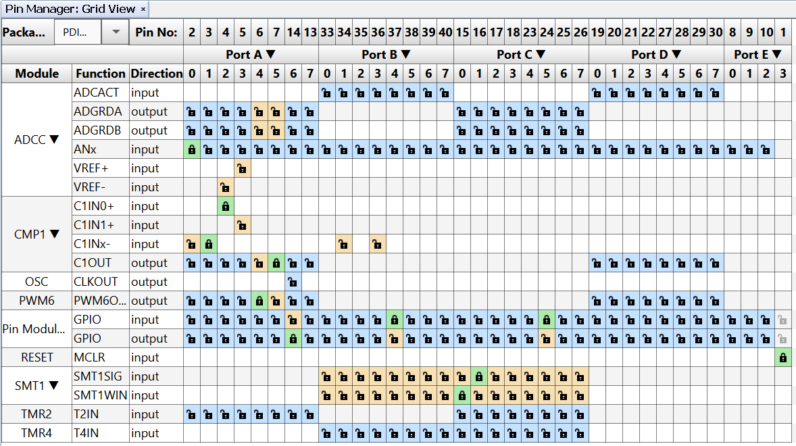
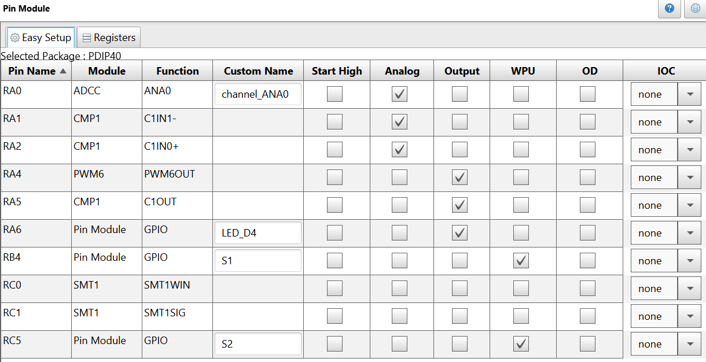

### Demo Code

The source code for this project can be downloaded from the current page by clicking the "Download" button, or if you want to make your own project, please pay attention to the following steps:

- After making the MCC Settings, press the "Generate" button, and it will generate the required C and header files.
- Then please go to the "smt1.c" file and comment this function:

so that it does not conflict with the same function from the "main.c" file, where the ISR code was added.

- Also in the "main.c" file, don't forget to enable the interrupts by uncommenting these lines:

## Demo 
1. After making the above hardware connections, connect the Curiosity HPC board to PC using the USB cable.
2. Build demo firmware and load the generated hex file onto the PIC16F18875 MCU.
3. Rotate the potentiometer to adjust the DC motor speed.
4. Increase the load on the motor and notice the PWM duty cycle increases (D2 LED becomes brighter) in order to keep the speed constant.
5. Increase the load until motor stops, then remove the load and notice the motor does not start again, because the motor driving was automatically turned off.

## Conclusion

This example shows how easy it is to use a timer with HLT functionality in order to add safety to a motor control application and prevent the damaging of the motor driving circuit.
